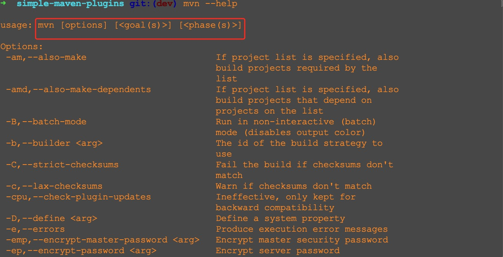

# 动手写几个简单的 maven 插件

## 简单回顾 mvn 命令
在日常开发的过程中，我们经常会跟 [maven](https://maven.apache.org/index.html) 打交道。

在命令行输入 `mvn --help` 可以看到 `mvn` 命令的用法如下


### 指定 phase
先举几个与 `phase` 有关的例子
1. `mvn clean` 指定了 `clean lifecycle` 中的 `clean phase` 
2. `mvn compile` 指定了 `default lifecycle` 中的 `compile phase`
3. `mvn test` 指定了 `default lifecycle` 中的 `test phase`

`lifecycle` 和 `phase` 之间的对应关系可以参考 [Lifecycle Reference](https://maven.apache.org/guides/introduction/introduction-to-the-lifecycle.html#lifecycle-reference)

### 指定 goal
再举几个和 `goal` 有关的例子
1. `mvn dependency:analyze`
2. `mvn dependency:tree`
3. `mvn dependency:list`

这三个命令都是指定了 `goal`。
其中 `dependency` 是插件前缀([Introduction to Plugin Prefix Resolution
](https://maven.apache.org/guides/introduction/introduction-to-plugin-prefix-mapping.html) 一文讲了一些插件前缀的内容，我个人理解，插件前缀就是插件的一个简短名称)，
`analyze`, `tree`, `list` 是这个插件的三个 `goal`。
在命令行执行
```bash
mvn dependency:help
```
就能看到 `maven-dependency-plugin` 具体有哪些 `goal`。

`maven` 插件本质上是一些 `jar`包，在合适的时机，这些 `jar` 包中的代码会被执行。
我们可以写一些简单的插件来体验一下。

## 实战
[Your First Mojo](https://maven.apache.org/guides/plugin/guide-java-plugin-development.html) 
讲述了如何写一个简单的 `maven` 插件。

我对这篇文章的理解是
1. `maven` 插件中用了模版方法的设计模式(我们自己定义插件时，核心步骤是实现 `AbstractMojo` 类中的 `execute()` 方法)
2. 在 `AbstractMojo` 的子类中可以通过调用 `getLog()` 方法，向终端输出相关信息
3. 我们可以向 `maven` 插件(包括自己写的 `maven` 插件)传递参数

文章中举的例子可以输出 `Hello World`。
我们可以再试试别的功能。
我一共写了 4 个简单的插件，它们的功能如下
1. Hello World (相当于把 [Your First Mojo](https://maven.apache.org/guides/plugin/guide-java-plugin-development.html) 中的代码复制粘贴了一下)
2. `a + b`
3. 删除 `project.build.directory` 目录(可以看做 `maven-clean-plugin` 中 `clean goal` 的超级低阶版)
4. 展示 `project.build.directory` 目录下的所有 `class` 文件的名称

我创建了4个目录分别和这4个插件对应，具体如下
1. [simple-hello-plugin](simple-hello-plugin)
2. [simple-plus-plugin](simple-plus-plugin)
3. [simple-clean-plugin](simple-clean-plugin)
4. [simple-show-plugin](simple-show-plugin)

为了展示插件的运行效果，我创建了 [simple-service](simple-service)。
可以在 [simple-service](simple-service) 中执行这些插件的 `goal`。 
该项目的 [顶层 pom.xml](pom.xml) 内容如下
```xml
<?xml version="1.0" encoding="UTF-8"?>
<project xmlns="http://maven.apache.org/POM/4.0.0"
         xmlns:xsi="http://www.w3.org/2001/XMLSchema-instance"
         xsi:schemaLocation="http://maven.apache.org/POM/4.0.0 http://maven.apache.org/xsd/maven-4.0.0.xsd">
    <modelVersion>4.0.0</modelVersion>

    <groupId>org.example.simple</groupId>
    <artifactId>simple-maven-plugins</artifactId>
    <version>1.0-SNAPSHOT</version>
    <packaging>pom</packaging>

    <modules>
        <module>simple-plus-plugin</module>
        <module>simple-hello-plugin</module>
        <module>simple-clean-plugin</module>
        <module>simple-show-plugin</module>
        <module>simple-service</module>
    </modules>

</project>
``` 

整个项目的 `java` 代码量不到两百行，所以是一个比较小的项目。

下面分别介绍4个插件
### 插件1: Hello World
[simple-hello-plugin/README.md](simple-hello-plugin/README.md)
### 插件2: `a + b`
[simple-plus-plugin/README.md](simple-plus-plugin/README.md)
### 插件3: 删除 `project.build.directory` 目录
[simple-clean-plugin/README.md](simple-clean-plugin/README.md)
### 插件4: 展示 `project.build.directory` 目录下的所有 `class` 文件的名称
[simple-show-plugin/README.md](simple-show-plugin/README.md)

[项目地址](https://github.com/fanofxiaofeng/simple-maven-plugins)