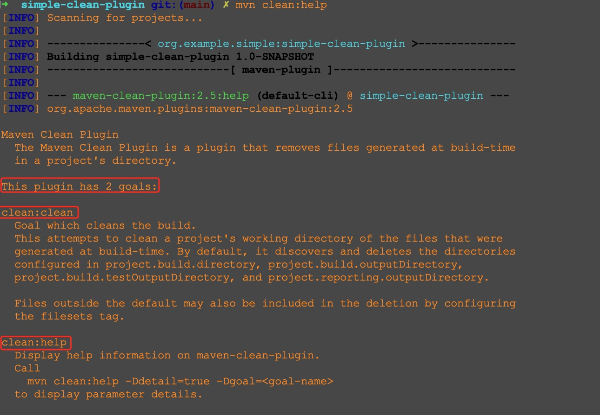

# 插件3: 删除 `project.build.directory` 目录
## 背景回顾：与 `clean` 有关的四个概念
`maven` 中的 `lifecycle` `phase` `plugin` `goal` 这四个概念都和 `clean` 有点关系，
下面分别介绍。

### clean lifecycle
`maven` 有如下三种 `lifecycle` (详情请参考 [lifecycle-reference](https://maven.apache.org/guides/introduction/introduction-to-the-lifecycle.html#lifecycle-reference))
1. `clean`
2. `default`
3. `site`

### clean phase
每个 `lifecycle` 由若干个 `phase` 组成。
其中 `clean lifecycle` 由如下的三个 `phase` 组成 (详情请参考 [lifecycle-reference](https://maven.apache.org/guides/introduction/introduction-to-the-lifecycle.html#lifecycle-reference))
1. `pre-clean`
2. `clean`
3. `post-clean`

### maven-clean-plugin 和它的 clean goal

在命令行输入如下命令后，会看到 [maven-clean-plugin](https://maven.apache.org/plugins/maven-clean-plugin/)  有两个 `goal`。
```bash
mvn clean:help
```

这两个 `goal` 分别是
1. `clean:clean` (如果插件的版本是 `3.1.0` 的话，那么对应的全称是 `org.apache.maven.plugins:maven-clean-plugin:3.1.0:clean`)
2. `clean:help`

[clean-mojo.html](https://maven.apache.org/plugins/maven-clean-plugin/clean-mojo.html) 介绍了 `clean:clean` 这个 `goal`。 
其中的一部分内容如下
> Goal which cleans the build.
> This attempts to clean a project's working directory of the files that were generated at build-time. By default, it discovers and deletes the directories configured in project.build.directory, project.build.outputDirectory, project.build.testOutputDirectory, and project.reporting.outputDirectory.  
> Files outside the default may also be included in the deletion by configuring the filesets tag.

可见 `clean:clean` 的作用是删除某些目录。

### 四者的关系
`clean phase` 隶属于 `clean lifecycle`，
`clean:clean` 这个 `goal` 与 `clean phase` 有绑定关系(`maven` 内置的绑定关系请参考 [built-in-lifecycle-bindings](https://maven.apache.org/guides/introduction/introduction-to-the-lifecycle.html#built-in-lifecycle-bindings))。

## 实战
### 设定目标
[source-repository.html](https://maven.apache.org/plugins/maven-clean-plugin/source-repository.html)
提到 `maven-clean-plugin` 的源代码在 [https://github.com/apache/maven-clean-plugin/tree/maven-clean-plugin-3.1.0](https://github.com/apache/maven-clean-plugin/tree/maven-clean-plugin-3.1.0) 中。

我把这个插件的代码下载下来浏览了一下(我看得并不仔细，所以可能理解有误)。
有一个名为 `CleanMojo` 的类和 `clean goal` 是对应的

它的核心逻辑，看起来就是下图红框的这些地方(遍历 `getDirectories()` 的返回结果，对其中的每个元素递归地执行删除操作)

而 `getDirectories()` 方法中的 `else` 分支里，会把 `directory` 对应的 `File` 也添加进来(逻辑如下图)。

而 `directory` 字段的值是和 `project.build.directory` 对应的(如下图)。 


所以 `CleanMojo` 类是可以删除 `project.build.directory` 目录的(除此之外，也能删除其他目录)。
我们可以把它做为参考，写一个简单的插件，来完成 "删除 `project.build.directory` 目录" 的功能。

### 代码
定了目标之后，就可以写代码了，核心代码如下(里面的逻辑参考了 `maven-clean-plugin`，递归删除目录的方法参考了 [Java中删除文件、删除目录及目录下所有文件](https://www.cnblogs.com/eczhou/archive/2012/01/16/2323431.html)，在此表示感谢)
```java
@Mojo(name = "clean")
public class CleanMojo extends AbstractMojo {

    @Parameter(defaultValue = "${project.build.directory}", readonly = true, required = true)
    private File directory;

    public void execute() throws MojoExecutionException, MojoFailureException {
        delete(directory);
    }

    private void delete(File directory) {
        // 递归删除目录，参考了 https://www.cnblogs.com/eczhou/archive/2012/01/16/2323431.html 一文

        // 如果是不是目录，则直接删除
        if (directory.isFile()) {
            getLog().info("Deleting " + directory);
            directory.delete();
            return;
        }

        // 如果是目录，则需要递归地现将其子元素删除，最后再将此目录删除
        for (String filename : directory.list()) {
            delete(new File(directory, filename));
        }
        getLog().info("Deleting " + directory);
        directory.delete();
    }
}
```
完整的代码在 [CleanMojo.java](src/main/java/org/example/simple/plugins/clean/CleanMojo.java) 中

### 验证
我们回到项目顶层目录

依次执行下述命令就会看到对应的效果
```bash
# 把 simple-clean-plugin 插件安装到本地 
mvn install

# 切换目录
cd simple-service/

# 应该会看到 simple-service 目录下 target 路径被删除的效果
mvn org.example.simple:simple-clean-plugin:1.0-SNAPSHOT:clean
```
最后一个命令的执行效果示例如下(完整的结果略有点长，我只截取了前面一部分)

