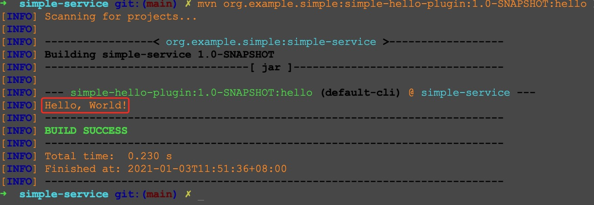
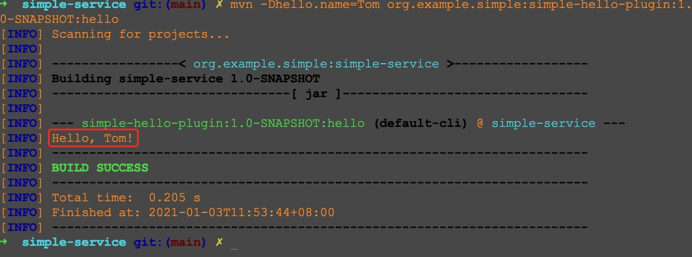

# 插件1: Hello World
这个插件的内容比较简单，基本就是把 [guide-java-plugin-development.html](https://maven.apache.org/guides/plugin/guide-java-plugin-development.html) 里的相关代码抄了抄。

核心代码如下
```java
// name 和 goal 的名称对应
@Mojo(name = "hello")
public class HelloMojo extends AbstractMojo {

    // 可以把参数传给 maven 插件
    @Parameter(property = "hello.name", defaultValue = "World")
    private String name;

    public void execute() throws MojoExecutionException, MojoFailureException {
        getLog().info(String.format("Hello, %s!", name));
    }
}
```
完整的代码在 [HelloMojo.java](src/main/java/org/example/simple/plugins/hello/HelloMojo.java) 中。

此插件中的 [pom.xml](pom.xml) 文件内容如下
```xml
<?xml version="1.0" encoding="UTF-8"?>
<project xmlns="http://maven.apache.org/POM/4.0.0"
         xmlns:xsi="http://www.w3.org/2001/XMLSchema-instance"
         xsi:schemaLocation="http://maven.apache.org/POM/4.0.0 http://maven.apache.org/xsd/maven-4.0.0.xsd">
    <modelVersion>4.0.0</modelVersion>

    <artifactId>simple-clean-plugin</artifactId>
    <version>1.0-SNAPSHOT</version>
    <packaging>maven-plugin</packaging>

    <parent>
        <groupId>org.example.simple</groupId>
        <artifactId>simple-maven-plugins</artifactId>
        <version>1.0-SNAPSHOT</version>
    </parent>

    <dependencies>
        <dependency>
            <groupId>org.apache.maven</groupId>
            <artifactId>maven-plugin-api</artifactId>
            <version>3.0</version>
        </dependency>

        <!-- dependencies to annotations -->
        <dependency>
            <groupId>org.apache.maven.plugin-tools</groupId>
            <artifactId>maven-plugin-annotations</artifactId>
            <version>3.4</version>
            <scope>provided</scope>
        </dependency>
    </dependencies>

</project>
```

假设现在是在项目的顶层目录(即与 [顶层 pom.xml](../pom.xml) 在同一层级)，
依次执行下述命令就会看到对应的效果
```bash
# 把 simple-hello-plugin 插件安装到本地 
mvn install

# 切换目录
cd simple-service/

# 应该会输出 Hello, World!
mvn org.example.simple:simple-hello-plugin:1.0-SNAPSHOT:hello

# 应该会输出 Hello, Tom!
mvn -Dhello.name=Tom org.example.simple:simple-hello-plugin:1.0-SNAPSHOT:hello
```

后两个命令的执行效果示例如下


