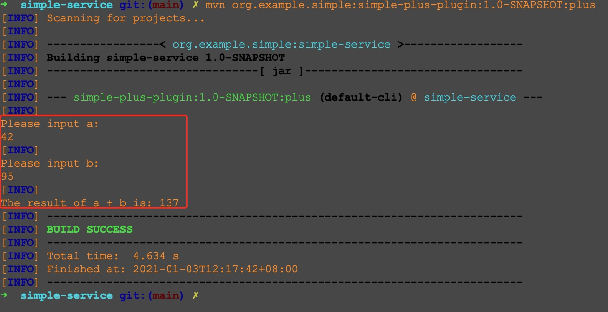
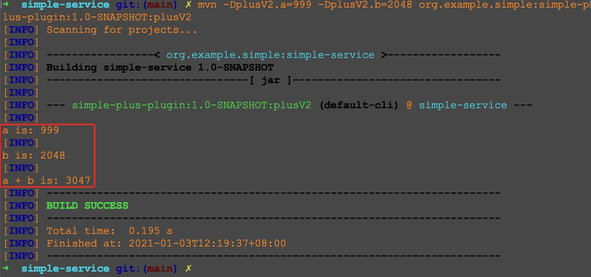

### 插件2: `a + b`
`a + b` 是一道经典的题目，[这里](http://poj.org/problem?id=1000) 可以看到一个例子。

代码逻辑也比较直接，让用户输入 `a` 和 `b` 的值，然后把 `a + b` 的结果输出即可。

核心代码如下
```java
/**
 * calculate a plus b
 */
@Mojo(name = "plus")
public class PlusMojo extends AbstractMojo {

    public void execute() throws MojoExecutionException, MojoFailureException {
        Scanner scanner = new Scanner(System.in);

        getLog().info("\nPlease input a:");
        int a = scanner.nextInt();

        getLog().info("\nPlease input b:");
        int b = scanner.nextInt();

        getLog().info(String.format("\nThe result of a + b is: %s", a + b));
    }
}
```
完整的代码在 [PlusMojo.java](src/main/java/org/example/simple/plugins/plus/PlusMojo.java) 中

让用户自己输入 `a` 和 `b` 的值感觉有点麻烦，所以我又写了第二个版本的代码。
核心代码如下
```java
/**
 * calculate a plus b
 * version 2
 */
@Mojo(name = "plusV2")
public class PlusMojoV2 extends AbstractMojo {

    @Parameter(property = "plusV2.a")
    private int a;

    @Parameter(property = "plusV2.b")
    private int b;

    public void execute() throws MojoExecutionException, MojoFailureException {
        getLog().info("\na is: " + a);
        getLog().info("\nb is: " + b);
        getLog().info("\na + b is: " + (a + b));
    }
}
```
完整的代码在 [PlusMojo2.java](src/main/java/org/example/simple/plugins/plus/PlusMojo2.java) 中

我们回到项目顶层目录
依次执行下述命令就会看到对应的效果
```bash
# 把 simple-plus-plugin 插件安装到本地 
mvn install

# 切换目录
cd simple-service/

# 应该会看到 a + b 的结果(a 和 b 的值需要自行输入)
mvn org.example.simple:simple-plus-plugin:1.0-SNAPSHOT:plus

# 应该会输出 a + b 的结果
mvn -DplusV2.a=999 -DplusV2.b=2048 org.example.simple:simple-plus-plugin:1.0-SNAPSHOT:plusV2
```

后两个命令的执行效果示例如下


