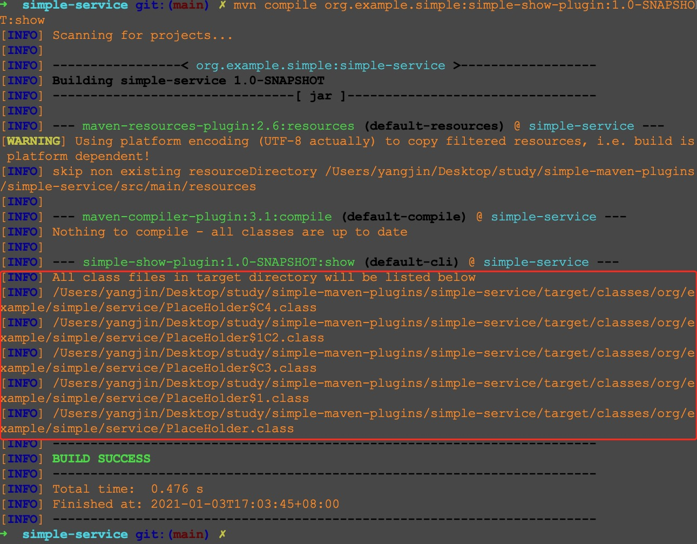

# 插件4：展示所有 `class` 文件的名称
[插件3](../simple-clean-plugin) 可以把 `project.build.directory` 目录删除，
换个思路，我们其实也可以把这个目录下的文件的名称都展示出来。
`java` 文件在编译后会生成对应的 `class` 文件，那么我们就把目标定为"展示`project.build.directory` 目录下所有 `class` 文件的名称"吧。

整体的思路和 [插件3](../simple-clean-plugin) 很像，也是需要递归地进行处理。

核心代码如下
```java
@Mojo(name = "show")
public class ShowMojo extends AbstractMojo {

    @Parameter(defaultValue = "${project.build.directory}", readonly = true, required = true)
    private File directory;

    public void execute() throws MojoExecutionException, MojoFailureException {
        getLog().info("All class files in target directory will be listed below");
        show(directory);
    }

    private void show(File directory) {
        if (directory.isFile()) {
            // 只展示名称以 ".class" 结尾的文件的名称
            if (directory.toString().endsWith(".class")) {
                getLog().info(directory.toString());
            }
            return;
        }

        for (String filename : directory.list()) {
            show(new File(directory, filename));
        }
    }
}
```
完整的代码在 [ShowMojo.java](src/main/java/org/example/simple/plugins/show/ShowMojo.java) 中


我们回到项目顶层目录
依次执行下述命令就会看到对应的效果
```bash
# 把 simple-plus-plugin 插件安装到本地 
mvn install

# 切换目录
cd simple-service/

# 应该会看到 target 目录下的所有 class 文件的名称
mvn compile org.example.simple:simple-show-plugin:1.0-SNAPSHOT:show 
```

最后一个命令的执行效果示例如下


